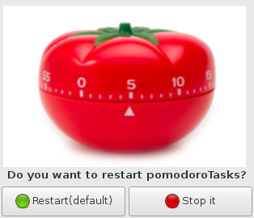
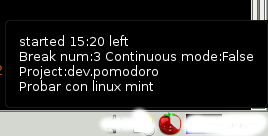
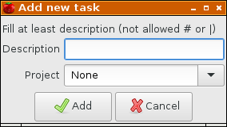

[ ](https://copr.fedorainfracloud.org/coprs/liloman/githubs/package/pomodoroTasks2)

Don't make any excuse anymore to not use the [Pomodoro Technique wikipedia](https://en.wikipedia.org/wiki/Pomodoro_Technique) or [The Pomodoro Technique ](extras/technique.pdf)!

Pomodoro technique allows you to concentrate on the current task and take short breaks meanwhile works.
If you get that and join it with a task manager alike taskwarrior (or any other) you can have a complete workflow, accounting the time spend on any task meanwhile you take the proper rests for your brain, body, life and eyes. :)


Table of Contents
=================

* [INSTALL](#install)
    * [Packages](#packages)
    * [Manual](#manual)
       * [1. Taskwarrior dependencies (python based)](#1-taskwarrior-dependencies-python-based)
       * [2. Timewarrior](#2-timewarrior)
       * [3. PomodoroTasks2](#3-pomodorotasks2)
* [Why do I need timewarrior?](#why-do-i-need-timewarrior)
* [Reminders](#reminders)
* [Screenshots](#screenshots)
* [Spec](#spec)
* [TODO](#todo)
* [FIXED](#fixed)


###INSTALL 

####Packages

1. Fedora 24/25 x86:

```bash
dnf copr enable liloman/githubs
dnf install pomodoroTasks2
```

Packages for Debian/Ubuntu/Slack/... to come. 


####Manual

#####1. Taskwarrior dependencies (python based)

```bash
pip install tasklib --user
sudo dnf/apt-get/whatever install taskwarrior/task/whatever
task <<< yes
```

##### 2. Timewarrior

```bash
sudo dnf/apt-get/whatever install build-essential cmake 
git clone --recursive https://git.tasktools.org/scm/tm/timew.git timew.git
cd timew.git
git checkout master 
cmake -DCMAKE_BUILD_TYPE=release .
make
sudo make install
timew <<< yes
```

#####3. PomodoroTasks2

```bash
git clone https://github.com/liloman/pomodoroTasks2
cd pomodoroTasks2/
./pomodoro-daemon.py
```

You can customize the working time and the break times (short and long), just exporting a few ENV variables in your ~/.bashrc.

```bash
#default pomodoro session (minutes)
export POMODORO_TIMEOUT=25
#default pomodoro short break (minutes)
export POMODORO_STIMEOUT=5
#default pomodoro long break (minutes)
export POMODORO_LTIMEOUT=15
```


So just launch the pomodoro-daemon.py and you are ready to go, feel free to add it in ~/.local/bin,autostart,systemd,... :)


### Why do I need timewarrior?

Because you the objective is track all your workflow and nothing better for that purpose than the newcomer and taskwarrior brother timewarrior. :)

If you wish to track every task of taskwarrior in timewarrior you need to:

1. Execute the extras/prepare_hooks.sh script:

 So it will be: 

 ```bash
 git clone https://github.com/liloman/pomodoroTasks2
 cd pomodoroTasks2/
 ./extras/prepare_hooks.sh install .
 ```

 And for now on: 
 a. Each time you start/stop a task it will be tracked with timewarrior unless it contains the +notimew tag. ;) 

 b. Timewarrior will stop tracking on logout/shutdown

 c. Everytime that there's a pomodoro timeout the app automatically track  it

 d. You have a new timewarrior report for your work (everything within a +nowork tag) ;)


2. You can create these two aliases for cozyness in your ~/.bashrc I can guarantee that you will use them ;)
 
 
 ```bash
 alias twt='timew work today'
 alias tww='timew work :week'
 ```

3. If you want to track also the time the PC is off (I don't recommend it if you have several PCs and sync your tasks among them) you can execute after every log [this script](https://github.com/liloman/warriors/blob/master/last-boots.sh)

 So it will be: 
 
 ```bash
 cd your-autostart-dir/xinit/systemd/whatever/...
 wget https://raw.githubusercontent.com/liloman/warriors/master/last-boots.sh
 chmod u+x last-boots.sh
 
 ```
 
4. Start enjoying timewarrior!. :) 


 How much have I been working today? 
 
 ```bash
 prompt>twt
 Total by Tag from 2017-01-15 23:00:00 - 2017-01-16 09:59:28 (sorted by time)
 
 Tag                                                Total
  ----------------------------------       ---------------
 
 More stuff / pro:stuff                   0 days, 2:14:00
 Doing demo / pro:dev.demo                0 days, 3:04:49
                                         ----------------                   
 Total                                    0 days, 5:18:49
 
 ```

 Umm, 5:18 hours. Niiiiiiiiiiice. 
 
 So no remorse of conscience for today. ;)
 
 Of course you could know how much have you worked this week for a project for example:
 
 ```bash
  prompt>tww pro:awesome
 Total by Tag from 2017-01-08 23:00:00 - 2017-01-15 23:00:00 (sorted by time)
 
 Tag                                                Total
 ----------------------------------       ---------------
 
 Fixing that bugs 1/ pro:awesome          0 days, 0:14:00
 Fixing that bugs 2 / pro:awesome         1 days, 2:14:00
 Writing docs / +docs / pro:awesome       3 days, 3:04:49
                                         ----------------                   
 Total                                    4 days, 5:32:49
 
 ```

###Reminders 

It's another functionality included into pomodoroTasks2.


My use case is for that kind of tasks that you need to be reminded about and most time even on advance.  So I use it to remember birthdays, due times or important tasks for this week in conclusión as a tasks calendar. :)

It's based on taskwarrior recurrence tasks and basically you just need to create a task with the +reminder tag and it will be displayed on timeout as a remind for your rewarded spare time. ;)

I include the script I use myself to create them or you can use whatever you want just include a +reminder tag on any task and it'll be show up on timeout if it's on pending status.

My script can create 3 types of reminders:

1. Recurrent (ex: birthdate): You create a birthdate and set to be shown with x days on advance until its due date

2. NonRecurrent(from date): Create a task for the day/month/year and set it to be show x days on advance until its due date

3. Inmediate(from today!): Create a task to be shown from now on or after x days until it's done


If you installed the package it will add a new command to /usr/bin/ otherwise you have to copy it like:

 ```bash
git clone https://github.com/liloman/pomodoroTasks2
cd pomodoroTasks2/extras
cp add-reminder.sh wherever-you-want-it
 ```

Workflow to create the example:

 ```bash
$add-reminder.sh
Select the type of reminder
1) Recurrent (ex: birthdate)  3) Inmediate(from today!)
2) NonRecurrent(from date)
#? 3
Description:Example reminder for screenshot!
task add 'Example reminder for screenshot!' pro:tasks due:someday wait:today until:due+1d recur: +reminder  rc.dateformat=D/M/Y
Are you sure?
1) Yes
2) No
#? 1
Created task 35.
 ```

And here it's the result:


When you mark the task as done or check the checkbox it will be disappear from the timeout splash screen.


###Screenshots

Relax time:


Back to work:



Menu:




All trayicons:


Change current task:


Add new task:




###Spec

Minimalistic implementation with FSM (Finite State Machine) and some dbus niceness. :)


###TODO

- [x] dbus 
- [x] Timewarrior integration to track the complete lifespan of your computer. ;)
- [x] Dont wait a minute to refresh the trayicon when used the cli
- [x] Script to install/uinstall hooks
- [x] Explain/include reminders
- [ ] Add packages for Ubuntu/Debian/Arch/...
- [ ] Unit testing \(fix travis install ... \)

###FIXED

1. ~~Linux mint issues~~
2. ~~Eliminated cycle when closed app from the sysicon~~
